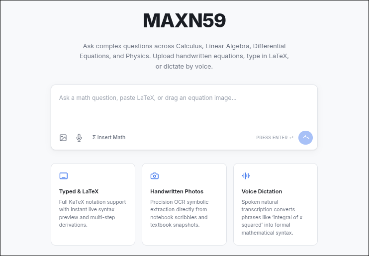

# MAXN59



A Flask-based AI chatbot specialized in mathematics. Ask questions via typed text, LaTeX, handwritten images, or voice — with step-by-step solutions rendered in KaTeX.

## Setup

```bash
python -m venv .venv
source .venv/bin/activate
pip install -r requirements.txt
cp .env.example .env   # then add your API keys locally
python app.py
```

Open http://127.0.0.1:5000

## API Keys

Add these to your local `.env` (never commit this file):

- `GROQ_API_KEY` — text chat and Whisper transcription
- `OPENROUTER_API_KEY` — vision/image analysis

## Endpoints

| Method | Path | Description |
|--------|------|-------------|
| `POST` | `/api/chat` | Text chat |
| `POST` | `/api/chat/image` | Image + optional caption |
| `POST` | `/api/chat/voice` | Audio → transcript → chat |
| `GET` | `/api/status` | Active model per provider |
